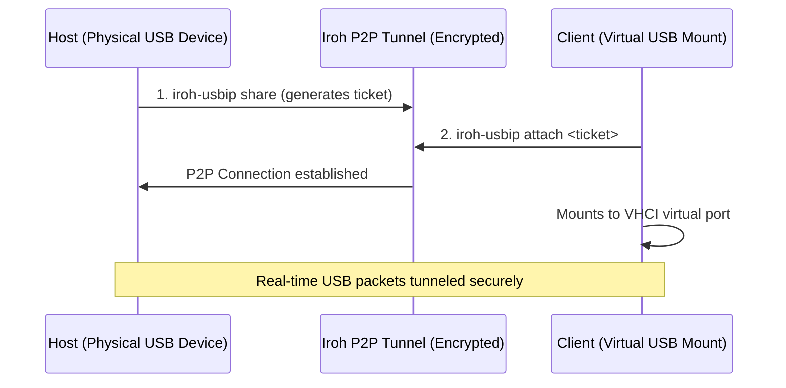

# iroh-usbip

> **Notice**: This is an AI-engineered project developed using the agentic engineering flows defined in [mattpocock/skills](https://github.com/mattpocock/skills).

Secure P2P USB-over-IP. Tunnel physical USB devices to remote clients over encrypted Iroh P2P streams with zero network configuration.

[](https://asciinema.org/a/dAc9YddFvIhRtANi)

## Documentation Index

To keep this project highly maintainable and avoid documentation drift, we separate system concerns:

- **Domain Model & Vocabulary**: See [CONTEXT.md](CONTEXT.md) for terminology (*Host*, *Client*, *Physical Device*, *Virtual Device*, *Bridge*).
- **Architectural Decision Records (ADRs)**: See [docs/adr/](docs/adr/) for design histories, including driver detachment and user-space limitations.
- **Product Requirements**: See [docs/prd.md](docs/prd.md) for scoping, goals, and non-goals.
- **Agent and Triage Guidelines**: See [AGENTS.md](AGENTS.md) and [docs/agents/](docs/agents/) for workspace labels and CLI issue tracker patterns.

---

## I. User Guide

This guide is for end-users who want to install the `iroh-usbip` tool and share or access USB devices.

### Prerequisites

#### Host Machine (Sharing physical devices)
*   **Linux/macOS**: No manual dependencies are needed. The system library `libusb-1.0` is statically compiled into the release. 
    *(Note: Sharing physical devices requires root/sudo privileges on both Linux and macOS to claim the USB interface and detach any active OS drivers).*
*   **Windows (Untested / Experimental)**: Supported but untested. Windows restricts direct user-space USB access, so you must associate the physical USB device you want to share with the `WinUSB` driver using [Zadig](https://zadig.akeo.ie/) before sharing.

#### Client Machine (Mounting remote devices)
*   **Linux**: Requires the `vhci-hcd` kernel module loaded. Load it with:
    ```bash
    sudo modprobe vhci-hcd
    ```
*   **Windows (Untested / Experimental)**: Requires a VHCI driver interface. Install the virtual controller driver from [usbip-win](https://github.com/cezanne/usbip-win).
*   **macOS**: Client support (mounting remote devices on macOS) is currently out of scope.

### Installation

#### Option 1: Quick Install (Recommended)
Install the latest pre-compiled binary via our installer scripts:
*   **macOS/Linux**:
    ```bash
    curl --proto '=https' --tlsv1.2 -LsSf https://github.com/seandlg/iroh-usbip/releases/latest/download/iroh-usbip-installer.sh | sh
    ```
*   **Windows**:
    ```powershell
    irm https://github.com/seandlg/iroh-usbip/releases/latest/download/iroh-usbip-installer.ps1 | iex
    ```

#### Option 2: Nix (Flake-enabled)
If you run Nix, you can install or run `iroh-usbip` directly:
*   Run without installing:
    ```bash
    nix run github:seandlg/iroh-usbip -- <args>
    ```
*   Install to your Nix profile:
    ```bash
    nix profile install github:seandlg/iroh-usbip
    ```

#### Option 3: From Source (Cargo Fallback)
To compile from source, you only need the standard Rust toolchain (2024 edition) and a C compiler (like `gcc`, `clang`, or MSVC build tools). The underlying `libusb-1.0` library is vendored and compiled statically automatically.

Install the binary directly from our GitHub repository:
```bash
cargo install --git https://github.com/seandlg/iroh-usbip
```

### Usage Workflow

`iroh-usbip` facilitates secure peer-to-peer sharing of USB devices directly over the internet without VPNs or port forwarding.



#### Roles
*   **Host**: The machine physically connected to the USB device. Running the `share` command detaches active OS drivers and serves the device.
*   **Client**: The machine that wants to mount the device virtually. Running `attach` maps the remote device to a virtual controller port.
*   **How Sharing Works**: Peer-to-peer (P2P) connections are established using the Iroh network. The traffic is end-to-end encrypted and automatically traverses firewalls and NATs using QUIC.

---

#### Concrete Walkthrough Example (Sharing a QEMU Tablet device)

Watch a live terminal recording of this walkthrough:
[](https://asciinema.org/a/dAc9YddFvIhRtANi)

##### 1. List physical USB devices on the Host
Find the Vendor/Product IDs (VID/PID) of the device you want to share:
```bash
iroh-usbip list
```
*Output:*
```text
Bus 001 Device 001: ID 1d6b:0001 Linux Foundation 1.1 root hub
Bus 001 Device 002: ID 0627:0001 Adomax Technology Co., Ltd QEMU Tablet
```
*(Note: If no devices show up or you get permission warnings, try running with `sudo iroh-usbip list`)*

##### 2. Share the device on the Host
Start the sharing server on the Host using the device's Vendor ID. This claims the device (detaching active kernel drivers) and prints a connection ticket:
```bash
sudo iroh-usbip share --vid 0627
```
*Output:*
```text
Sharing USB device Bus 001 Device 002: ID 0627:0001 QEMU QEMU USB Tablet...
Connection ticket:
endpointaaoj5z7ylpwmizgikhk352mave64budppioi36mxbc2vdze4yztwsbabaafhd4abv6oqeaiamruagmvptubacafzca6jnl45aiaqckqdiaaaacqcus4mk57772y547oexibq
Waiting for client to connect...
```

##### 3. Attach the device on the Client
On the Client machine, use the ticket to attach the device:
```bash
sudo iroh-usbip attach endpointaaoj5z7ylpwmizgikhk352mave64budppioi36mxbc2vdze4yztwsbabaafhd4abv6oqeaiamruagmvptubacafzca6jnl45aiaqckqdiaaaacqcus4mk57772y547oexibq
```
*Output:*
```text
Connecting to remote shared device via Iroh P2P...
Connected to Host! Querying shared devices...
Found remote device: 1-2 (speed: Full)
Attaching to local virtual port: 0
Successfully attached virtual device to VHCI port 0!
Device is now connected. Press Ctrl+C to disconnect.
```

##### 4. Verify Attachment on the Client
Run `lsusb` in another terminal on the Client. You will see the virtual device mounted on a new virtual bus:
```bash
lsusb
```
*Output:*
```text
Bus 001 Device 001: ID 1d6b:0001 Linux Foundation 1.1 root hub
Bus 001 Device 002: ID 0627:0001 Adomax Technology Co., Ltd QEMU Tablet
Bus 002 Device 001: ID 1d6b:0002 Linux Foundation 2.0 root hub
Bus 002 Device 002: ID 0627:0001 Adomax Technology Co., Ltd QEMU Tablet
Bus 003 Device 001: ID 1d6b:0003 Linux Foundation 3.0 root hub
```

Pressing `Ctrl+C` in either terminal cleanly terminates the P2P session, detaches the virtual device from the Client, and restores original drivers on the Host.

---

## II. Contributor Guide

This guide is for developers contributing to `iroh-usbip`.

### Development Prerequisites

To ensure a reproducible environment, this project uses **Nix** (specifically the **Lix** implementation with the **Crane** packaging library) to manage hermetic dependencies, build environments, and cached builds.

*   **Nix**: Install Nix and enable Flakes.
*   **direnv (Optional)**: Automatically load the Nix environment when you enter the directory.

If you are not using Nix, you must manually install:
- Rust toolchain (2024 edition)
- `libusb-1.0` dev library
- `pkg-config`
- `just` (task runner)
- `git-cliff` (changelog generator)
- `gh` (GitHub CLI)
- `python3`

### Entering the Development Environment

Enter the reproducible shell containing all toolchains, libraries (`libusb1`, `pkg-config`), and helper CLIs:
```bash
nix develop
```
*(Alternatively, configure `direnv` with `use flake` to load the environment automatically)*

### Nix & Cargo Interplay Guidelines

1.  **Idiomatic Cargo Flow**: Once inside `nix develop`, run standard Cargo commands directly (e.g. `cargo build`, `cargo test`). Spawning nested Nix subshells (like `nix develop --command cargo`) is avoided for local runs to keep feedback loops fast and IDE integrations (like Rust-Analyzer) working flawlessly.
2.  **Task Runner (`just`)**: We reserve the `justfile` purely for complex, multi-step orchestrations or privilege transitions (e.g. running kernel integration tests and release pipelines).

### Running / Testing Local Builds with Root Privileges

To test your local code modifications, you will compile the binary in user-space and run it as root. 
Because the `root` user does not inherit the Nix shell's environment paths, running standard `sudo target/debug/iroh-usbip` will fail due to missing dependencies. 

Use the `sudo -E env PATH="$PATH"` prefix to preserve the development environment:

*   **Share local build**:
    ```bash
    sudo -E env PATH="$PATH" ./target/debug/iroh-usbip share --vid <VID> --pid <PID>
    ```
*   **Attach local build**:
    ```bash
    sudo -E env PATH="$PATH" ./target/debug/iroh-usbip attach <TICKET>
    ```

### Testing Scopes

We separate testing into two distinct environments and privilege scopes:

#### 1. Hermetic Checks (Mock Unit & Integration Tests)
These tests run without any physical USB hardware or host-level kernel permissions. They use in-memory stream mocks and mock devices.
*   Run clippy and format checks:
    ```bash
    cargo fmt --all --check
    cargo clippy --all-targets -- --deny warnings
    ```
*   Run all hermetic unit and mock integration tests:
    ```bash
    cargo test
    ```
*   Nix hermetic check (runs clippy, formatting, and unit tests inside a sandboxed build derivation):
    ```bash
    nix flake check
    ```

#### 2. Native E2E Integration Tests (Linux Only)
These tests verify real kernel integration against the Linux Virtual Host Controller Interface (VHCI) driver. Because they load kernel modules (`vhci-hcd`, `dummy-hcd`, `libcomposite`) and configure configfs/sysfs, they **must run natively on the host** with root/sudo privileges.
*   Run the E2E integration test:
    ```bash
    just test-e2e
    ```
    *Note: The runner automatically compiles the binary as the normal user first, then runs `scripts/e2e.sh` using `sudo -E env PATH="$PATH"` to preserve the Nix-provided dependencies.*
*   Run the E2E test in Mock Mode (does not require root or Linux VHCI):
    ```bash
    just test-e2e --mock
    ```

### Continuous Integration (CI)
Our GitHub Actions pipeline (defined in `.github/workflows/ci.yml`) runs on every commit/PR:
1.  **Nix Setup**: Installs Nix/Lix and configures **Magic Nix Cache** for incremental store caching.
2.  **Hermetic Checks**: Executes `nix flake check` to verify formatting, clippy, and unit tests inside the sandbox.
3.  **E2E Testing**: Runs the unsandboxed mock E2E integration tests using `nix develop --command scripts/e2e.sh --mock`.

### Release Process (Automation & SemVer)

We use a double-gated, mistake-proof release workflow built around `cargo-dist` and `git-cliff`. All release actions must be run inside `nix develop`.

#### **How to release:**

1.  **Prepare Release** (from a clean `main` branch inside `nix develop`):
    Determine the next version according to Semantic Versioning (SemVer) rules:
    *   **Patch** (`0.1.x`): For bug fixes, refactorings, chores, and internal improvements.
    *   **Minor** (`0.x.0`): For new features (e.g. support for a new command).
    *   **Major** (`x.0.0`): For breaking changes.

    Run the task runner recipe to prepare the release:
    ```bash
    just prepare-release <version>
    ```
    *Gate 1 (Poka-Yoke):* This will fail if the latest commit on `main` has not passed GitHub Actions CI. If green, it creates a `release/v<version>` branch, bumps the version in `Cargo.toml`, updates `CHANGELOG.md` via `git-cliff`, and commits the changes.

2.  **Submit PR & Merge**:
    Push the `release/v<version>` branch to GitHub, open a PR, and merge it to `main` once PR checks (including E2E checks) succeed.

3.  **Tag and Publish** (inside `nix develop`):
    Pull the merged commit locally on `main` and run:
    ```bash
    just tag-release
    ```
    *Gate 2 (Poka-Yoke):* This will fail if the post-merge CI on `main` hasn't completed successfully yet. If green, it creates the annotated git tag `v<version>` and pushes it, which triggers `cargo-dist` in CI to compile binaries, package installers, and publish the GitHub Release.
